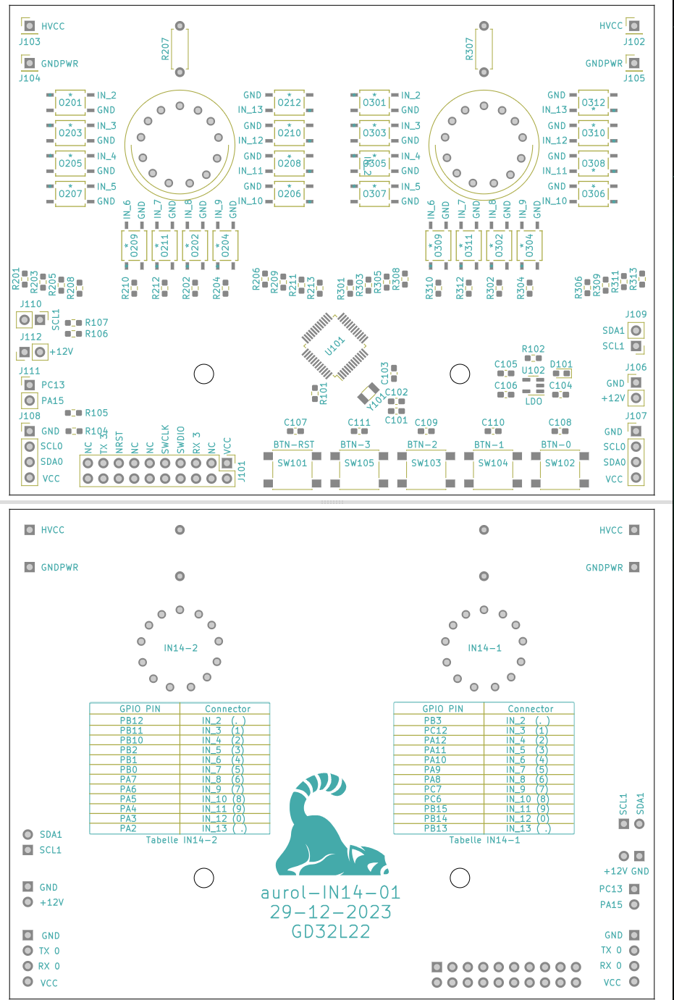

# Hardware Design
The Printed Circuit Board (PCB) was designed in KiCAD as a two layer board with a separation of the voltage domain for the nixie tubes (HVCC=200V) and the board input voltage (VCC=12V). The finished PCB is displayed in the figure below:

<p align="center">

</p>


Currently the power-supply is not contained in the board design and provided through an external DCDC-converter. A similar one can be used as the on sold [here](https://www.amazon.de/dp/B07H4L5NHG). 

The structure of the `01_Circuit_Board/` folder is as follows:
```
01_Circuit_Board/
    |-- bom/
    |-- footprints.pretty/
    |-- socket/
    |-- <KiCAD-Project files>
```
The following paragraphs explain briefly the content of each subfolder. 

# Componentes
In the subfolder `bom/` you can find the Bill of Materials (BOM), which contains all components and the correstponding positions on the PCB used in this project. The BOM is displayed as a simple HTML file, which you can open in your prefered web-browser simply by clicking [here](./01_Circuit_Board/bom/BOM_aurol_IN14_01.html). 

# Custom Footprints
The footprints located in the subfolder `footprints.pretty/` (default name in KiCAD) are used for the optocouplers, the custom IN-14 nixie-tube sockets. 

# Nixie-Tube Socket
In order to provide a universal socket for the IN-14 nixie-tubes, the subfolder `socket/` contains an openSCAD script, as well as the STL file for the 3D printable socket. In combination with [female connector pins](https://www.amazon.de/dp/B0C1GNPGRV) the socket can be assembled as a through-hole component, which can be soldered on the PCB.