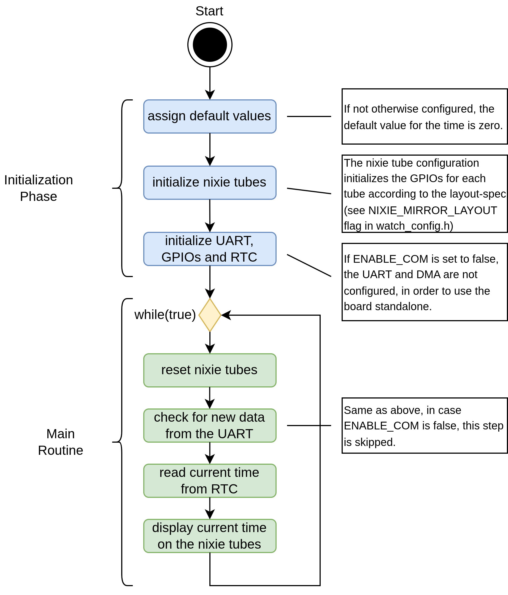
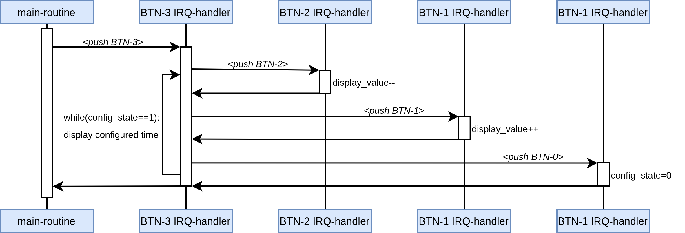

# Software Design
The software implementation for the nixie clock utilizes the [Firmware Library](https://www.gd32mcu.com/en/download/7?kw=GD32L2) SVD-file (`GD32L23x.svd`) avaiable at the GigaDevices website sd well as a simple custom linker-script (`GD32L2xx.ld`), startup code (`GD32:startup.c`).

## Getting started
In order to build the code, please install the following prerequisites on your PC. Depending on the corresponding operating system, the installation method might differ from the one explained here. On Linux (Debian) execute the follwoing command in a terminal window:
```sh
sudo apt update \
sudo apt install make arm-none-eabi-gcc gdb
```

Subsequently navigate to the `02_Sofware` folder of the repository and create a build folder by executing the following command:
```sh
mkdir build
```

Lastly, build the application by typing the following command in the terminal.
```sh
make all
```

If everything works correctly, the build successful promt should appear in the terminal window.

For cleaning up or rebuilding the software, the `Makefile` also supports the commands **make new** and **make clean**. 

## Flashing and Debugging
For flashing and debugging we utilize a [J-Link](https://www.segger.com/products/debug-probes/j-link/) debug probe. The necessary software for this debugger can be downloaded from the companies website. 

In combination with the cortex-debug plugin in Visual Studio Code, we can directly flash and program the microcontroller. For further information, please refer to the `launch.json` and `c_cpp_properties.json` files in the `.vscode/` subfolder.  

## Design Concept
The software design is intended to be as simple as possible and provide the clock configuration asynchronously through interrupt service routines, while the display of the current time is managed in the main routine.

<p align="center">

</p>

As displayed in the figure above, the main routine implementation first initializes all peripherals and after that periodically polls the RTC, as well as the UART implementation for new values to display. 

### Clock Configuration
Through pushing buttons BTN-3 to BTN-0, the current time can be set in the watch. The implementation for this works as follows.

<p align="center">

</p>

As displayed in the figure above, the nixie-clock switches into the configuration mode by pushing button 3. In this IRQ-routine the config_state flag is set to 1 and iterates over a display of the current configuration value until button 0 is pressed to reset the config_state flag back to 0 and terminate the configuration mode. 

Buttons 2 and 3 can be used to increase or decrease the currently displayed value of the nixie-tube module. By bridging the Jumper `J111` on the PCB before start-up, the implementation can be set to display the current minutes, otherwise it displays the current hours. 
