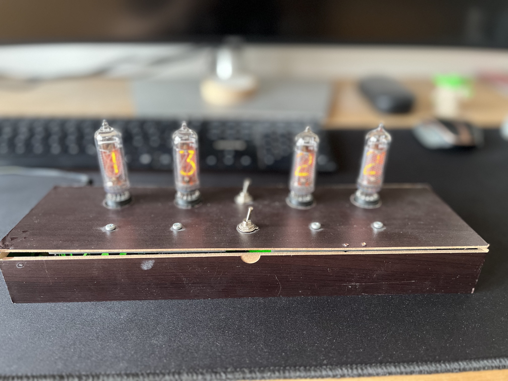
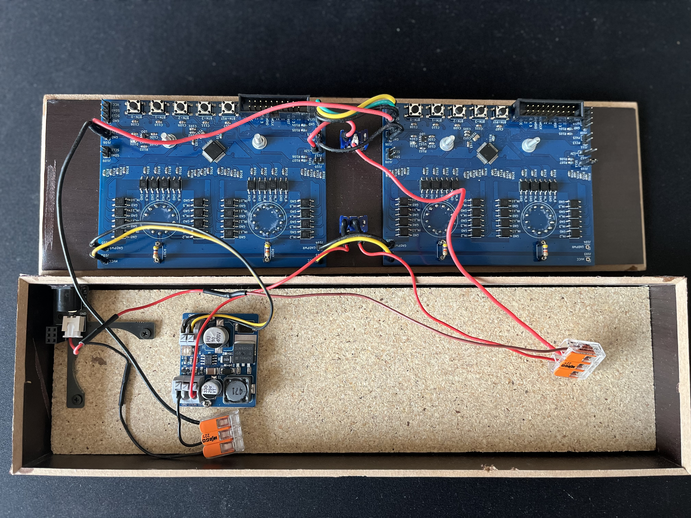

# IN14-Nixie Tube Clock Module
This project contains the shematics, software implementation and documentation for a clock displaying the current time on nixie-tubes. The clock utilizes a GigaDevices GD32L233 microcontroller (ARM Cortex-M33), which triggers the displayed digits in the tubes via voltage-domain separation through LTV-352T optocouplers. 

The current design is planned to display hours and minutes, but it can be extended to display the seconds as well. 

The general structure of the project is as follows:
```
IN14_Nixie_Clock_Module/
|-- 01_Circuit_Board/
|-- 02_Software/
|-- 03_Datasheets/
```
In the folder `01_Circuit_Board` you can find all relevant files for the hardware part of this project. This includes the KiCAD project, footprints for the custom components and the CAD script for the custom tube socket. In folder `02_Software` you can find the implementation of the clock. As this is a module, the Board can be used as standalone application (although this does not make much sense, since you need at least two PCBs to display the current time) or as a set of two to display hour and minutes. A clock consisting of three boards is currently not supported, but can be extended in the future. Lastly in `03_Datasheets` you can find further information about the components in use. 


# Finished Prototype
The current prototype of a finished implementation of the clock is displayed in the figure below.

<p align="center">

</p>

For the wiring between the modules and the DCDC-converter please consider the following image:

<p align="center">

</p>

Since this is a prototype, we used dupont crimp connectors and wago cage clamps. In a finished product these could be replaced by fixed/soldered wires.

# Contributing
I would like to thank [@LStromaier](https://github.com/LStrohmaier) for working along side me at this project and reviewing the hardware and software implemenatations. 